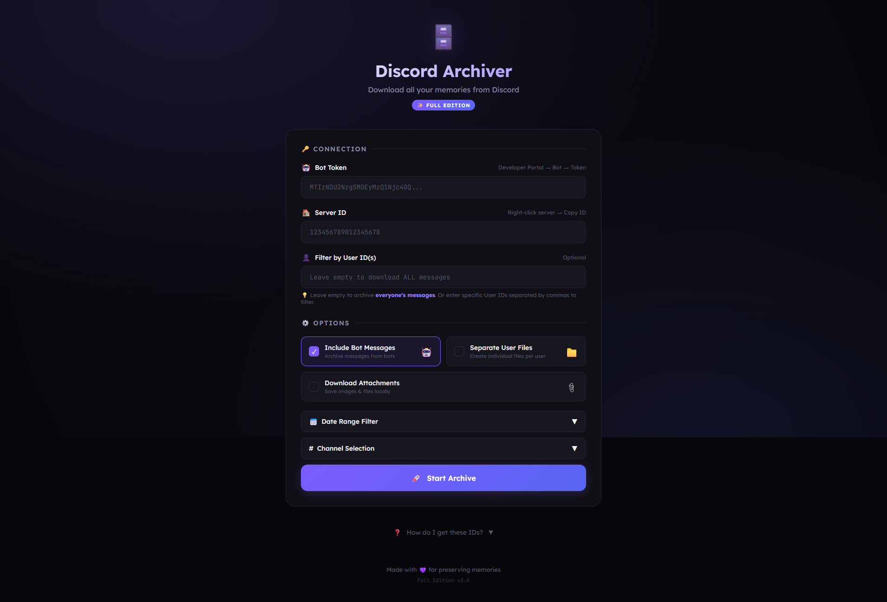

# 🗄️ Discord Archiver

> **A self-hosted, privacy-first tool for archiving your Discord server message history to your own machine — no cloud, no third parties, just your data.**


---

## 📸 Demo



> Enter your bot token and server ID, pick your channels, and hit **Start Archive** — everything stays on your machine.

---

> **⚠️ Compliance & Safety Warning**
>
> This tool is designed for **personal archival purposes only** — backing up your own servers or message history.
>
> - **Do not** use this tool to mass-scrape servers you don't own or administer.
> - **Respect rate limits:** Aggressive scraping violates Discord's Terms of Service and can result in account termination.
> - **Privacy:** Do not distribute archives containing other users' data without their consent.
> - **Liability:** The user assumes all responsibility for data privacy compliance (GDPR/CCPA) and account safety.

---

## ✨ Features

| Feature | Description |
|---------|-------------|
| 🌐 **Local Web UI** | Clean browser-based interface — no command line needed after setup |
| 📄 **Multiple Export Formats** | JSON, human-readable TXT, per-channel and per-user files |
| 📎 **Attachment Downloads** | Optionally download images, videos, and files alongside messages |
| 🔒 **100% Self-Hosted** | Your data never leaves your machine — no cloud, no accounts |
| ⚙️ **Configurable via `.env`** | Adjust port, concurrency, and more without touching the code |
| 🔍 **Filter by User, Channel & Date** | Archive only what you need |
| ⏹️ **Cancellable Downloads** | Stop a running archive at any time |
| 🛡️ **Safe by Default** | Conservative concurrency defaults to avoid Discord rate limits |

---

## 📦 What's in the Archive?

Every export produces a ZIP file containing:

| File | Description |
|------|-------------|
| `*_messages.json` | Full message data in JSON — portable and developer-friendly |
| `*_readable.txt` | Human-readable chat log, organized by channel |
| `by_channel/*.txt` | Individual text file per channel |
| `by_user/*.json` | Per-user message files *(optional, enable in settings)* |
| `attachments/` | Downloaded images, videos, and files *(optional)* |
| `archive_info.json` | Summary: total messages, users, channels, date range |

---

## 🚀 Quick Start

### 🪟 Windows

1. Download or clone this repo
2. Double-click **`install.bat`** — checks Python, installs dependencies, creates a `run.bat` shortcut
3. Double-click **`run.bat`** to start the app
4. Open **http://localhost:5000** in your browser

---

### 🐧 Linux / macOS / Chromebook

**Chromebook users:** First enable Linux — go to **Settings → Advanced → Developers → Linux development environment → Turn on**. Then open the **Terminal** app.

```bash
# 1. Install Python (skip if already installed)
sudo apt update && sudo apt install -y python3 python3-pip   # Debian/Ubuntu/Chromebook
# brew install python                                         # macOS with Homebrew

# 2. Clone the repo
git clone https://github.com/TanaTTV/discord-archiver.git
cd discord-archiver

# 3. Run the installer
chmod +x install.sh
./install.sh

# 4. Start the app
./run.sh
```

Open **http://localhost:5000** in your browser.

> **Chromebook tip:** After starting the app, open Chrome and go to `http://localhost:5000` — it works in your normal Chrome browser, no extra steps needed.

---

### Manual (any platform)

```bash
git clone https://github.com/TanaTTV/discord-archiver.git
cd discord-archiver
pip install -r requirements.txt
python app.py
```

Open **http://localhost:5000** in your browser.

---

## 🤖 Setting Up a Discord Bot

Discord Archiver uses a bot token to read your server's message history through Discord's official API.

### Step 1 — Create an Application

1. Go to the [Discord Developer Portal](https://discord.com/developers/applications)
2. Click **"New Application"** → give it a name → **Create**

### Step 2 — Create a Bot

1. In your application, go to the **Bot** section
2. Click **"Reset Token"** → copy the token and keep it safe
3. Scroll down and enable these **Privileged Gateway Intents**:
   - ✅ **Server Members Intent**
   - ✅ **Message Content Intent**

### Step 3 — Invite the Bot to Your Server

1. Go to **OAuth2 → URL Generator**
2. Under **Scopes**, check: `bot`
3. Under **Bot Permissions**, check:
   - ✅ Read Messages / View Channels
   - ✅ Read Message History
4. Copy the generated URL, paste it in your browser, and invite the bot to your server

### Step 4 — Run & Archive

1. Start the app (`run.bat` or `python app.py`)
2. Paste your **Bot Token** and **Server ID** into the web UI
3. Click **"Load Channels"** to select which channels to include
4. Configure your options (date range, user filter, attachments, etc.)
5. Click **"Start Archive"** and watch the real-time progress
6. Download your ZIP when it's done

---

## 🖱️ Using the App

Once the app is running and you've opened `http://localhost:5000`, here is exactly what to do.

---

### Step 1 — Fill in the Connection Fields

**Bot Token**
Paste your bot token here. It looks like a long string of random characters. This is how the app connects to Discord — keep it private and never share it.

**Server ID**
The ID of the Discord server you want to archive. It is a long number like `123456789012345678`. See [How to Find Your IDs](#-how-to-find-your-ids) below.

**Filter by User ID(s)** *(optional)*
Leave this blank to archive **everyone's messages** in the server.
Enter your own User ID to only save **your messages**.
Enter multiple User IDs separated by commas to filter to specific people.

---

### Step 2 — Choose Your Options

**Include Bot Messages**
- ✅ On — bot messages (automated responses, commands, etc.) are included in the archive
- ⬜ Off — only human messages are saved

**Separate User Files**
- ✅ On — creates an extra folder in the ZIP with one file per user, so you can see each person's messages separately
- ⬜ Off — all messages are in one combined file (recommended for most people)

**Download Attachments**
- ✅ On — images, videos, and files shared in the server are downloaded and included in the ZIP
- ⬜ Off — only text messages are saved (much faster, much smaller file size)

> ⚠️ Enabling attachments on a large server can produce very large ZIP files and take a long time. Start without it to test.

---

### Step 3 — Apply Filters *(optional)*

Click **Date Range Filter** to expand it.
- Set a **From** date to only archive messages after that date
- Set a **To** date to only archive messages before that date
- Leave both blank to archive everything

Click **Channel Selection** to expand it.
- Click **Load Channels** to fetch the list of channels from your server
- Check/uncheck individual channels to include or exclude them
- Use **Select All** to toggle everything at once
- Leave all unchecked to archive every channel

---

### Step 4 — Start the Archive

Click **🚀 Start Archive**.

You will see a real-time progress screen showing:
- Which channel is currently being scanned
- How many channels have been completed
- How many messages have been found so far
- Attachment download progress (if enabled)

> You can click **Cancel** at any time to stop. Messages already collected will still be available to download.

---

### Step 5 — Download Your Archive

When the progress bar hits 100% and shows **Done**, you will see two options:

- **Download ZIP** — saves the archive directly to your Downloads folder through the browser
- **Save to Local Folder** — saves the ZIP to the `downloads/` folder inside the project directory

---

### Step 6 — Opening Your Archive

Extract the ZIP file and you will find:

| File | How to open it |
|------|----------------|
| `*_readable.txt` | Open with Notepad, TextEdit, or any text editor — easiest to read |
| `*_messages.json` | For developers — open with a code editor or import into other tools |
| `by_channel/` | One text file per channel — open any in a text editor |
| `by_user/` | One file per user *(if Separate User Files was enabled)* |
| `attachments/` | All downloaded images and files — open normally |
| `archive_info.json` | Summary stats — total messages, users, date range |

The `*_readable.txt` file is the easiest for most people — it looks like a chat log with timestamps, names, and messages.

---

## ⚙️ Configuration

All settings live in the `.env` file (created automatically from `.env.example` on first run via `install.bat`).

| Variable | Default | Description |
|----------|---------|-------------|
| `PORT` | `5000` | Port the web UI runs on |
| `CONCURRENT_CHANNELS` | `1` | Channels scanned in parallel — keep at `1` to avoid rate limits |
| `CONCURRENT_DOWNLOADS` | `5` | Attachment downloads in parallel — keep low to stay safe |

> **⚠️ Warning:** Raising `CONCURRENT_CHANNELS` or `CONCURRENT_DOWNLOADS` significantly increases the risk of Discord rate-limiting or flagging your bot token.

---

## 🔍 How to Find Your IDs

> **First:** Enable Developer Mode — Discord **Settings → Advanced → Developer Mode**

| ID | How to Get It |
|----|---------------|
| **Bot Token** | Developer Portal → Your App → Bot → Reset Token |
| **Server ID** | Right-click server icon → **Copy Server ID** |
| **User ID** | Right-click your username → **Copy User ID** |

---

## 🆕 Recent Updates

### v2.0 — Stability & Usability Overhaul
- **`install.bat`** — one-click Windows installer that sets up everything automatically
- **`.env` configuration** — no more editing Python code to change settings; use the `.env` file
- **Cancellation support** — stop a running download at any time via the UI or `/api/cancel`
- **Concurrent download protection** — starting a second download while one is running now returns a clear error instead of corrupting state
- **Proper error logging** — all errors are now logged with context instead of being silently swallowed
- **Fixed startup banner** — now shows your actual configured values instead of hardcoded numbers
- **CORS locked to localhost** — the API is no longer exposed to other origins
- **Python 3.13+ compatibility** — `audioop-lts` dependency is now conditional on Python version
- **Flexible dependencies** — `requirements.txt` now uses `>=` versions so pip finds the right wheels for your Python version

---

## 🔮 Coming Soon

- [ ] **HTML export** — browse your archive like a real chat interface in your browser
- [ ] **DM backup support** — archive direct messages and group DMs
- [ ] **Scheduled backups** — run automatic archives on a timer
- [ ] **Search & filter** — find specific messages inside a saved archive
- [ ] **CSV export** — open your messages directly in Excel or Google Sheets
- [ ] **Incremental backups** — only download new messages since your last archive
- [ ] **Theme toggle** — light mode option for the web UI

---

## 🔧 Troubleshooting

| Problem | Solution |
|---------|----------|
| "Invalid bot token" | Verify the token is complete — try resetting it in the Developer Portal |
| "Server not found" | Make sure the bot has been invited to the server |
| "No messages found" | Check your User ID is correct and the bot can see those channels |
| "A download is already in progress" | Wait for the current download to finish or click Cancel |
| `pip install` fails | Make sure Python 3.10+ is installed and on your PATH |
| Port already in use | Change `PORT=5000` to another port in your `.env` file |
| Chromebook: Linux not available | Go to Settings → Advanced → Developers → Linux development environment → Turn on |
| Chromebook: `python3` not found | Run `sudo apt update && sudo apt install -y python3 python3-pip` in Terminal |
| `./install.sh`: Permission denied | Run `chmod +x install.sh` first, then `./install.sh` |

---

## 📖 How It Works

```
Browser UI  →  Flask API  →  Discord Bot (discord.py)
                                    ↓
                          Reads message history
                          via official Discord API
                                    ↓
                          Filters by channel / user / date
                                    ↓
                          Downloads attachments (optional)
                                    ↓
                          Packages everything into a ZIP
                                    ↓
                          Download or save to disk
```

1. You enter your bot token and server ID in the browser UI
2. A Discord bot connects using the official `discord.py` library
3. It scans selected channels and collects message history
4. Optionally downloads attachments in parallel batches
5. Everything is packaged into a ZIP archive on your machine
6. You download the ZIP or save it to the local `downloads/` folder

---

## 🤝 Contributing

Contributions are welcome! Please make sure any changes stay compliant with Discord's Terms of Service.

1. Fork the repository
2. Create a feature branch: `git checkout -b feature/your-feature`
3. Commit your changes: `git commit -m 'Add your feature'`
4. Push: `git push origin feature/your-feature`
5. Open a Pull Request

---

## 📄 License

MIT License — see [LICENSE](LICENSE) for details.

---

## ⚠️ Disclaimer

This software is provided "as-is" for personal archival purposes. The developers assume no liability for violations of Discord's Terms of Service, account suspensions, privacy violations, or any damages arising from the use of this software.

**Use responsibly and at your own risk.**

---

---

## ⭐ Support the Project

If Discord Archiver saved your memories or saved you time, consider giving it a star — it helps others find the project.

[](https://github.com/TanaTTV/Discord-Archiver/stargazers)

**Found a bug?** → [Open an issue](https://github.com/TanaTTV/Discord-Archiver/issues/new/choose)
**Have an idea?** → [Start a discussion](https://github.com/TanaTTV/Discord-Archiver/discussions)
**Want to contribute?** → Fork it, build it, PR it.

---

*Built for personal data sovereignty and digital archival.*
